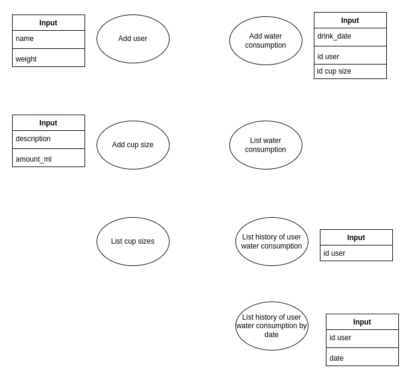

ℹ️ **Notice:** This README is written in Brazilian Portuguese (pt-br).

## Projeto: API pra app "lembrar de beber água (teste técnico)"

#### Wireframe do app:


#### Requisitos:

- O objetivo é construir uma API backend pra um app de "lembrar de beber água".
- Neste app, os usuários podem registrar quantos mls de água já beberam ao longo dos dias e se estão dentro de uma meta diária pré-estabelecida.
- A meta diária pode ser definida a partir do peso da pessoa em Kg _ 35ml. Ex: pessoa pesa 70kg _ 35 => 2450mls por dia de meta.
- Principais fluxos de telas:
  - **Na tela 1:** a pessoa pode se cadastrar com seu nome e peso em Kg.
  - **Na tela 2:** a pessoa pode ver quantos ml já tomou e registrar que tomou uma quantidade X de água. Depois de fazer o registro, ela consegue visualizar os dados do momento atual do dia (quantos ml já bebeu, quantos ml faltam, se já bateu a meta diária, etc.)
  - **Na tela 3:** a pessoa pode ver o registro dos dias que já cadastrou no app ao longo do tempo.

#### OBS:

- Pode ser feito em qualquer linguagem/stack, porém tem bonus point se for feito em Python (Django, Flask, etc.)
- A parte do frontend está fora do escopo, mas pode ser opcional caso o candidato queira incluir.
- A parte de autenticação (login/logout) está fora de escopo. Os usuários podem ser identifiacados pelo seu ID de forma explícita. Ex: passando o ID do usuário pelo endpoint da API, ou por headers, query string, etc.
- Disponibilizar o código no Github do candidato. Não é obrigatório fazer deploy do projeto em algum servidor de cloud.
- Desejável ter alguma camada de testes automatizados no código.
- Desejável ter um vídeo apresentando o uso da API (ex: usando Postman pra chamar os endpoints) e um vídeo apresentando a arquitetura/estrutura geral do projeto.
- Após concluir a API, faremos um pair programming onde eu (tech lead) vou fazer um papel de PO técnico e podemos ir colocando complexidade na API conforme vamos evoluindo.

---

## Volpi tech team - trilha inicial de estudos (checkin em conversas de contratação):

- Git intermediário
  - criação de branches e merge de branches
  - criação de repositório remoto (ex: integrando com Github)
  - rebase vs merge
- Conhecimento básico de algum framework web, cobrindo o padrão MVC. Ex:
  - Python + Django (framework web)
  - Considerar: Flask + FastAPI, na stack de Python
- Conhecimento básico de algum ORM (Object Relational Mapper) de banco de dados relacional:
  - Ex: Django ORM, SQLAlchemy
  - Considerar: pymongo pra MongoDB (banco de dados orientado a documentos)
- Conhecimento básico sobre testes automatizados / unit tests

---

## Arquitetura microsserviços


---

## Funcionalidades



## Instalar dependências

```bash
poetry install --no-root && rm -rf $POETRY_CACHE_DIR
```

## Iniciar iniciar aplicativo

```bash
poetry run uvicorn drink_water_tracker.main:app
```
