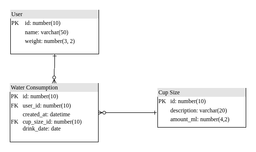

## Drink water tracker: API for water reminder app

#### App wireframe:


#### Requirements:

- The goal is to build a backend API for a "drink water reminder" app.
- In this app, users can track how many milliliters (ml) of water they have consumed throughout the day and whether they are within a pre-established daily goal.
- The daily goal can be set based on the user's weight in kilograms (35ml per KG). For example, if a person weighs 70kg \* 35ml => 2450ml per day as the goal.
- Key screen flows:
  <br><br>
- **On Screen 1:** Users can register with their name and weight in kilograms.
  <br><br>
  
  <br><br>
- **On Screen 2:** Users can see how many ml they have consumed and record that they have consumed a certain amount of water. After recording, they can view the current day's data (how many ml they have consumed, how many ml are left, whether they have reached the daily goal, etc.).
  <br><br>
  
  <br><br>
- **On Screen 3:** Users can view the records of the days they have registered in the app over time.
  <br><br>
  

---

## Microservices architecture


---

## Database entity-relationship diagram



---

## Features


## Install dependencies

```bash
poetry install --no-root && rm -rf $POETRY_CACHE_DIR
```

## Start application

```bash
poetry run uvicorn drink_water_tracker.main:app
```

## Migrations

```bash
cd drink_water_tracker/

alembic init migrations

alembic revision --autogenerate -m "add user table"
alembic upgrade head
```

## Run tests

```bash
pytest
pytest --cov
pytest --cov --cov-report=html:coverage_re

# run especific test
pytest -k test_add_user_uc
```
